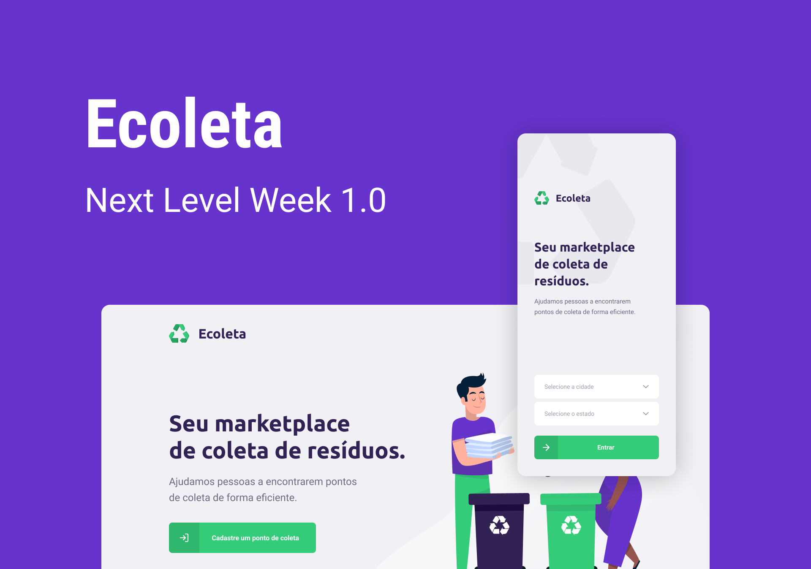

<p align="center">
  
</p>

> Projeto criado durante a Next Level Week da @Rocketseat.

> Feito para ajudar pessoas a encontrarem pontos de coleta de forma eficiente.

# Instalação

## Backend

Clone o repositorio usando o seu terminal:

```bash
git clone https://github.com/matheus-santos-moreira/Ecoleta.git
```

Depois navegue até a pasta backend e digite:

```bash
npm install
```

Depois:

```bash
npm run knex:migrate
npm run knex:seed
```

Se tudo deu certo até aqui, digite:

```bash
npm run dev
```

## WEb

Depois navegue até a pasta web e digite:

```bash
npm install
```

Se tudo deu certo, digite para rodar sua aplicação:

```bash
npm start
```

Sua aplicação estará rodando em [http://localhost:3000](http://localhost:3000)

## Mobile

Para essa parte iremos utilizar o Expo.

O Expo é uma plataforma de código aberto para criar aplicativos nativos universais para Android, iOS e web com JavaScript e React.

Para isso iremos na loja de aplicativos do nosso smartphone e iremos baixar o Expo.

Agora navegue até a pasta mobile e digite:

```bash
npm install
```

Digite para rodar sua aplicação:

```bash
npm start
```

O Expo DevTools irá abrir no seu navegador, é só abrir o aplicativo que acabamos de instalar e escanear o QRCode e 'voialá' a magíca acontece.

## Entre em contato

👤 **Matheus Santos**

- Github: [@matheus-santos-moreira](https://github.com/matheus-santos-moreira)
- LinkedIn: [@matheus-santos-moreira](https://linkedin.com/in/matheus-santos-moreira)

## Mostre seu apoio

Dê um ⭐️ você gostou deste projeto.
